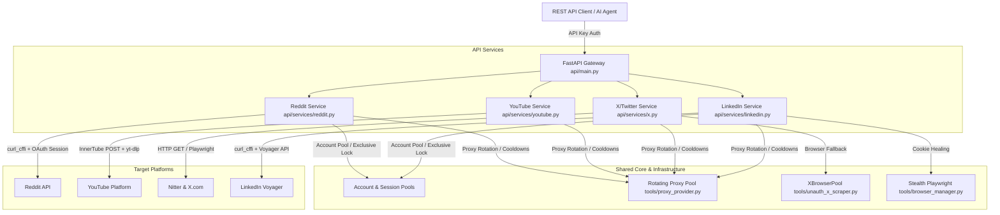

# Reddit Stealth Scraper

A robust, production-ready, multi-platform scraping gateway for **Reddit, YouTube, X (Twitter), and LinkedIn**. 
This system is designed to provide high-throughput, stealthy scraping capabilities by wrapping various official/public API surfaces and web scraper implementations behind an authenticated FastAPI REST service. It also exposes these scraping capabilities as Model Context Protocol (MCP) tools for AI agents (like Claude Code, Cursor, and Gemini).

---

## 🗺️ System Architecture



---

## 🛠️ Technology Stack

- **Core Framework**: Python 3.10+, FastAPI, Uvicorn
- **HTTP Client (Stealth)**: `curl-cffi` (impersonates modern Chrome browser TLS/JA3 fingerprints to bypass cloud security firewalls)
- **Browser Automation**: Playwright (equipped with custom stealth overrides in `tools/browser_manager.py`)
- **Media Resolvers**: `yt-dlp` (for YouTube stream extraction)
- **Database/Storage**: Supabase / JSON Session files (for persistence of account sessions and ban statuses)
- **Agent Integration**: FastMCP (exposes APIs as MCP tools over stdio/HTTP)

---

## 📂 Project Structure

```
reddit_stealth_scraper/
├── api/
│   ├── config.py              # Centralized environment-override configuration
│   ├── dependencies.py        # Shared API dependencies (Auth, HTTP client factory)
│   ├── main.py                # FastAPI entry point, worker initialization, and middleware
│   ├── routes/                # API routes grouped by target platform
│   ├── services/              # Scraping logic and platform wrapper implementations
│   └── worker_leader.py       # File-lock leader election for multi-worker setup
├── deployment/
│   ├── reddit_scraper.service # Systemd service unit for the FastAPI service
│   ├── reddit_scraper_mcp.service # Systemd service unit for the HTTP MCP Server
│   ├── setup_service.sh       # Automation script to deploy services on Linux VPS
│   ├── run_background.sh      # Local background runner script using nohup
│   ├── stop_background.sh     # Local background stopper script
│   ├── start_api.sh           # API startup script (wraps in xvfb-run & reads workers)
│   └── start_mcp.sh           # MCP server isolated venv startup script
├── tools/
│   ├── browser_manager.py     # Stealth Playwright runner configuration
│   ├── proxy_provider.py      # Background good-proxies.ru liveness & health check daemon
│   ├── rotation.py            # CooldownPool implementation for proxies and accounts
│   ├── account_risk.py        # Shadowban detection & passive risk classification
│   ├── ban_state_store.py     # State management for quarantined/banned accounts
│   └── unauth_x_scraper.py    # X/Nitter scraper engine with XBrowserPool
├── skills/                    # Claude Code plugin skills (e.g. social-research)
├── tests/                     # Automated unit and integration test suite
├── requirements.txt           # Main python project dependencies
└── mcp_server.py              # FastMCP gateway exposing REST endpoints as tools
```

---

## 🚀 Getting Started

### 1. Installation

Clone the repository and install the dependencies. It is recommended to use a virtual environment:

```bash
# Clone the repository
git clone <repo-url>
cd reddit_stealth_scraper

# Create a virtual environment
python -m venv .venv
source .venv/bin/activate  # On Windows: .venv\Scripts\activate

# Install dependencies
pip install -r requirements.txt

# Install Playwright browser binaries
playwright install chromium
```

### 2. Configuration (`.env`)

Copy the example environment file and configure the parameters:

```bash
cp .env.example .env
```

Ensure you populate key credentials, such as:
- `API_KEY`: The authentication key required to request Scraper API endpoints.
- `GOODPROXIES_API_KEY`: API key for good-proxies.ru proxy list supplier.
- Supabase credentials (if database session storage is enabled).

*See the [Configuration Reference](#%EF%B8%8F-configuration-reference) below for fine-tuning variables.*

### 3. Running the Server

#### Development Mode:
Start the server locally with auto-reload:
```bash
python api/main.py
```
The server will start at `http://127.0.0.1:8000`. You can access the Swagger UI documentation at `http://127.0.0.1:8000/docs`.

#### Production Mode (Background / Systemd):
Deploy the scraper as a systemd service on a Linux VPS. This manages virtual displays (`xvfb-run`) for browser-backed relogins and runs multiple Uvicorn workers.

```bash
# Set up and start systemd services (requires root/sudo)
sudo bash deployment/setup_service.sh
```

To run in the background without systemd/sudo privileges:
```bash
bash deployment/run_background.sh
```

---

## 🛡️ Core Capabilities & Scraping Mechanics

### 1. Reddit Scraper
- **Authentication**: Performs scraping through a pool of logged-in accounts.
- **Failover System**: On HTTP failure or rate-limit detection, it immediately rotates the IP (proxy) and Reddit account.
- **Exclusivity & Lock**: Employs an OS-level file lock (`api/worker_leader.py`) to prevent multiple workers from leasing the same account at once, protecting accounts from bans.
- **Ban Detection**: Implements passive risk classification (`tools/account_risk.py`) to track failure patterns (e.g. 403 streak) and quarantine banned/shadowbanned accounts.
- **Session Health Check**: A background daemon proactively checks session validity and uses a headless browser to perform relogins when a session expires.

### 2. YouTube Scraper
- **InnerTube API**: Directly sends POST queries to YouTube's internal API. No accounts or logins required. Highly scalable.
- **Performance**: Performs video player metadata fetching and comment loading concurrently using `asyncio.gather`, cutting response times in half.
- **Key Warmup**: Warmup task extracts the YouTube InnerTube API key on startup in the background, keeping extraction overhead out of the request path.
- **yt-dlp Resolver**: Provides stream URL extraction and proxy downloads through the `/youtube/download` endpoint.

### 3. X (Twitter) Scraper
- **Cheap-Path**: Attempts fetching via public Nitter instances using simple HTTP requests and a shared Cloudflare clearance token cache (`cf_clearance`).
- **Heavy-Path (Fallback)**: When HTTP endpoints fail, it falls back to a process-wide stealth Playwright pool (`XBrowserPool`).
- **XBrowserPool**: Keeps warm, reusable browser sessions alive to bypass the 5-15s startup cost of a new Chromium instance, serialized through async locks.

### 4. LinkedIn Scraper
- **Voyager API**: Simulates web client requests to the authenticated Voyager API.
- **Cookie Healing**: Runs Playwright in a headful/headless virtual display to perform 2FA/OTP login validation and save fresh session cookies (`li_at`) to storage.
- **Rate Pacing**: Splits configured RPM limits across workers to avoid triggering LinkedIn's aggressive rate-limiting firewalls.

---

## ⚙️ Configuration Reference

Tuning parameters are centralized in [api/config.py](file:///c:/Users/aman/reddit_stealth_scraper/api/config.py) and can be overwritten in `.env`:

| Variable | Default | Purpose |
|----------|---------|---------|
| `API_WORKERS` | `4` | Number of Uvicorn worker processes (per-worker browser pools). |
| `API_THREAD_POOL_SIZE` | `128` | Concurrency thread pool size for curl_cffi / yt-dlp calls. |
| `API_KEY` | (None) | Master secret key required to access `/api/v1/*` endpoints. |
| `API_AUTH_DISABLED` | `false` | Disable API key verification (dev only). |
| `GOODPROXIES_ENABLED` | `true` | Stock rotating proxy pool using good-proxies.ru API. |
| `GOODPROXIES_HEALTHCHECK_TIMEOUT` | `2.0` | Max proxy connect timeout on healthcheck admission. |
| `GOODPROXIES_HEALTHCHECK_URLS` | (Reddit & LinkedIn) | Stricter health verification across multiple targets. |
| `REDDIT_AUTO_RELOGIN` | `true` | Perform automated browser relogins when sessions die. |
| `ACCOUNT_BAN_DETECTION` | `true` | Enable passive ban & shadowban detection. |
| `X_WARMUP_ON_STARTUP` | `true` | Mint and cache Cloudflare tokens for X on startup. |
| `X_BROWSER_POOL_MAX` | `4` | Cap on the number of warm persistent browser instances. |

---

## 🤖 Model Context Protocol (MCP) Integration

The project exposes all scraping APIs as Model Context Protocol (MCP) tools for LLMs.

### Running MCP Locally
```bash
pip install -r requirements.txt
export SCRAPER_BASE_URL="http://127.0.0.1:8000"
export API_KEY="your-api-key"
python mcp_server.py
```

### Hosted (Remote) MCP Server
To allow client agents (like Claude Desktop) to connect to a centralized MCP server without installing dependencies:
```bash
# Set environment variables and start the server
MCP_TRANSPORT=http MCP_PORT=9000 SCRAPER_BASE_URL=http://127.0.0.1:18080 API_KEY="your-api-key" python mcp_server.py
```
This hosts the HTTP MCP service on port `9000`. You can configure a reverse proxy (e.g. Nginx with HTTPS) to expose it securely to client applications (see [nginx-scraper-mcp.conf](file:///c:/Users/aman/reddit_stealth_scraper/deployment/nginx-scraper-mcp.conf)).

---

## 🧪 Testing

The repository contains a full suite of automated test configurations under the `tests/` directory:

```bash
# Run the test suite
python -m pytest tests/
```

### ⚠️ Windows Developer Caveat
Uvicorn uses `SelectorEventLoop` under `--reload` on Windows. However, Playwright subprocesses require `ProactorEventLoop`. To reconcile this conflict, [api/main.py](file:///c:/Users/aman/reddit_stealth_scraper/api/main.py) uses a custom loop factory:

```python
# Custom factory wired to force ProactorEventLoop in workers
loop="api.main:proactor_loop_factory"
```
Ensure you run with `python api/main.py` which applies these patches on Windows environments.
